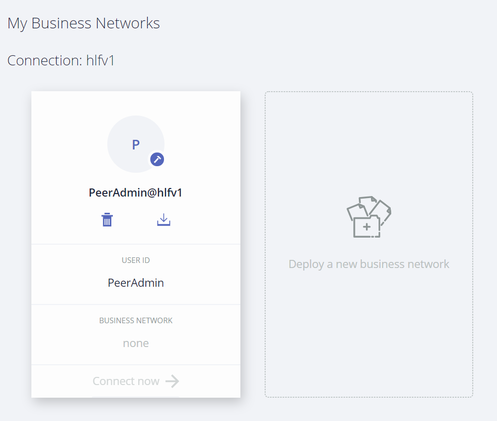
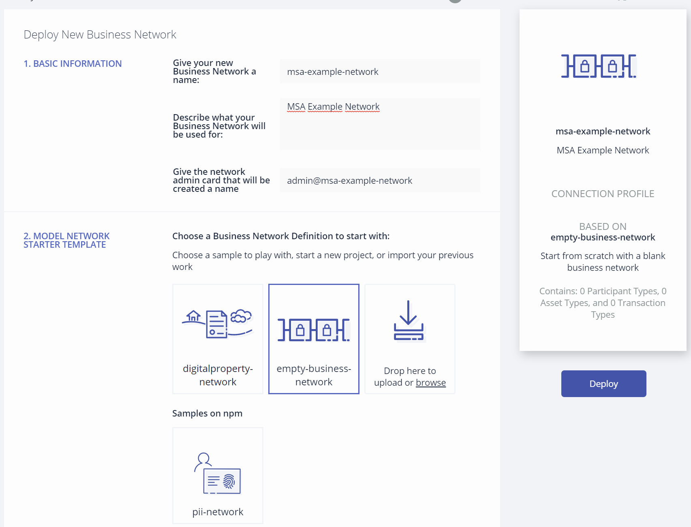
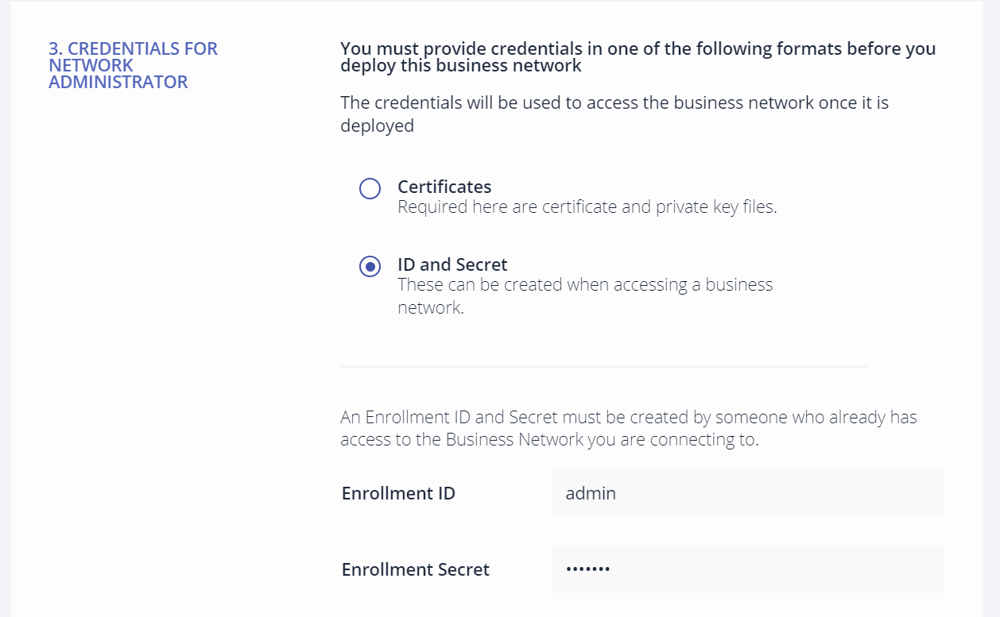
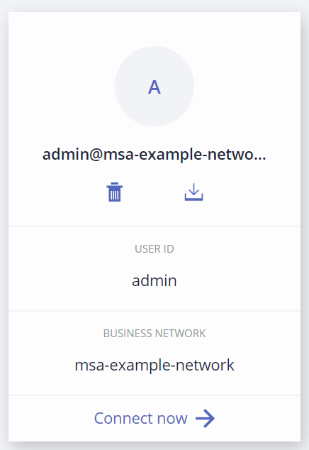
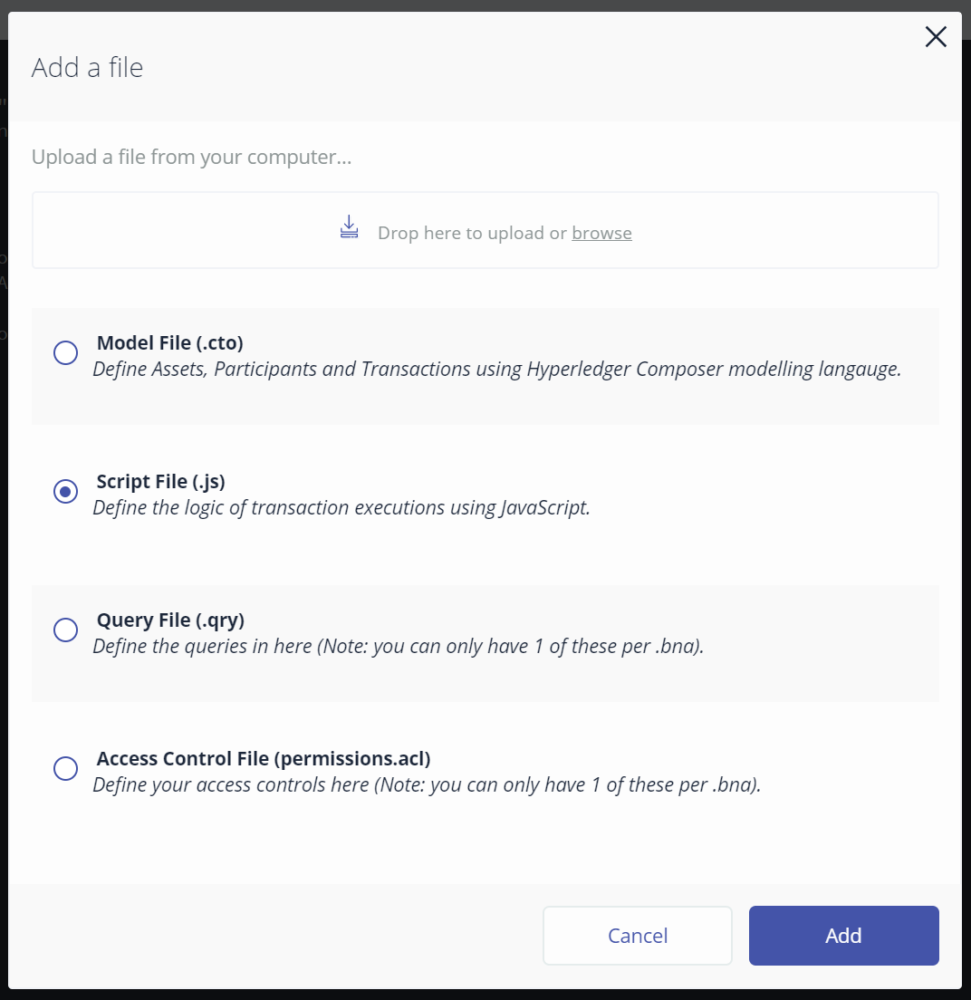
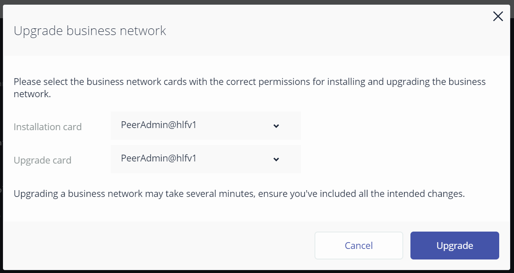
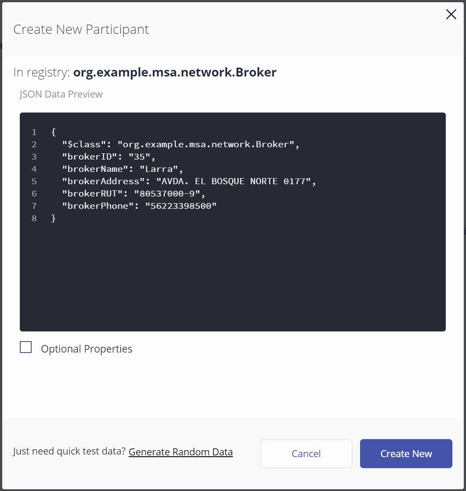
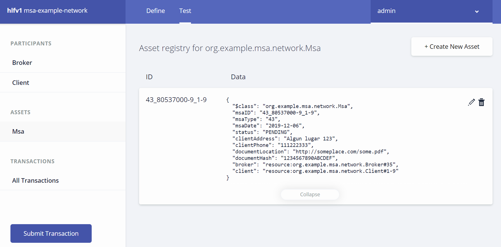

# Ejemplo de modelamiento

El siguiente es un ejemplo para iniciar la construcción de una red Fabric simple usando Hyperlerdger Composer.

## Prerequisitos

Es necesario haber iniciado Hyperledger Composer, tal como se menciona en el archivo [README.md](../../README.md) en la raíz de este repositorio.

En caso de haber iniciado anteriormente la máquina virtual y no haberla suspendido correctamente mediante el comando `vagrant suspend`, se recomienda ejecutar (desde el contexto del archivo `Vagrantfile`):

```shell
vagrant reload
```

En caso de que al reconectar a una máquina virtual provisionada anteriormente, no se apliquen los cambios al código y aparezca _"código antiguo"_, se recomienda ejecutar lo siguiente:

```shell
vagrant ssh
docker rm $(docker ps -aq)
docker rmi $(docker images "dev-*" -q)
```

Estos comandos eliminarán todas los contenedores Docker que no se encuentren en uso y todas las imágenes de contenedores de Smartcontracts creadas por Hyperledger Composer sobre la red Fabric local. Una vez finalizado, se puede usar el script `./start_composer.sh` para iniciar Hyperledger Composer.

## Crear Business Network

Una vez funcionando Hyperledger Composer, abrir la siguiente dirección en un browser: http://localhost:8080



Presionar en "Deploy a new business network" para continuar.

En el formulario, ingresaremos los siguientes valores:

- Give your new Business Network a name: msa-example-network
- Describe what your Business Network will be used for: MSA Example Network
- Give the network admin card that will be created a name: admin@msa-example-network
- Choose a Business Network Definition to start with: empty-business-network
- Credentials for network administrator: ID and Secret
- Enrollment ID: admin
- Enrollment Secret: adminpw




Presionar el botón _"Deploy"_

Una vez finalizado el proceso de deploy, presionar el enlace _"Connect now"_



## Crear Modelos de Datos

Lo primero será definir nuestro namespace en el __Model File__. Esto nos permite generar nombre únicos a nuestros tipos de recursos y participantes.

```javascript
namespace org.example.msa.network
```

Luego, definimos un Master Service Agreement (Contrato de acuerdo de servicio - MSA) con el siguiente código en el __Model File__:

```javascript
asset Msa identified by msaID {
  o String msaID
  o String msaType
  o String msaDate
  o String status
  o String clientAddress
  o String clientPhone
  o String documentLocation
  o String documentHash
  o String rejectReason optional
  o String rejectExplanation optional
  o String signedDate optional
  --> Broker broker
  --> Client client
}
```

Nuestra llave será el campo __msaID__. El recurso referencia a 2 participantes: un Corredor (Broker) y un Cliente (Client). De este modo, definimos los participantes agregando el siguiente código:

```javascript
participant Broker identified by brokerID {
  o String brokerID
  o String brokerName
  o String brokerAddress
  o String brokerRUT
  o String brokerPhone
}

participant Client identified by clientRUT {
  o String clientRUT
  o String clientName
}
```

Con esto contamos con un tipo de recurso (contratos MSA) y 2 participantes. En este escenario, el Corredor selecciona un Cliente existente y le emite (Issue) un contrato en estado _"PENDING"_ (pendiente). El cliente tiene la facultad de aprobar (Approve) el contrato mediante algún mecanismo, para que quede en estado _"APPROVED"_ (aprobado).

Es necesario definir ambas transacciones:

```javascript
transaction Issue {
  --> Broker broker
  --> Client client
  o String msaType
  o String msaDate
  o String clientAddress
  o String clientPhone
  o String documentLocation
  o String documentHash
}

transaction Approve {
  --> Client client
  o String msaID
  o String signedDate
}
```

La transacción Issue recibe como parámetros los 2 participantes, el tipo de contrato, la fecha, dirección del cliente, teléfono del cliente, URL del contrato y su hash para validaciones de integridad.

La transacción Approve recibe el cliente que está realizando la operación, el ID del contrato, y la fecha de firma.

## Agregar lógica de negocio

En Composer, presionar el botón _"Add a file..."_ y seleccionar _"Script File (.js)"_



En el __Script File__ agregar el siguiente código:

```javascript
/**
 * MSA Issue transaction processor function.
 * @param {org.example.msa.network.Issue} tx The Issue transaction instance.
 * @transaction
 */
async function issueMsa(tx) {
  // Basic validations
  if (!tx.broker || !tx.client || !tx.msaType || !tx.msaDate || !tx.clientAddress || !tx.clientPhone || !tx.documentLocation || !tx.documentHash) {
    throw new Error('Invalid parameters');
  }

  let msaAssetRegistry = await getAssetRegistry('org.example.msa.network.Msa');
  let factory = getFactory();
  let msa = factory.newResource('org.example.msa.network', 'Msa', tx.msaType + '_' + tx.broker.brokerRUT + '_' + tx.client.clientRUT);
  msa.msaType = tx.msaType;
  msa.msaDate = tx.msaDate;
  msa.status = 'PENDING';
  msa.clientAddress = tx.clientAddress;
  msa.clientPhone = tx.clientPhone;
  msa.documentLocation = tx.documentLocation;
  msa.documentHash = tx.documentHash;
  msa.broker = tx.broker;
  msa.client = tx.client;

  await msaAssetRegistry.add(msa);
}
```

Este método ejecuta una validación simple a los parámetros de entrada (valida que no sean nulos), para luego generar una nueva instancia del Asset __Msa__ identificado por la concatenación del tipo de contrato, el RUT del Corredor y el RUT del cliente. Una vez generado el Asset y habiendo completado los atributos mandatorios (no opcionales), se inserta el registro a la red. Este ejemplo permite conocer como crear un Asset dentro de una transacción.

Para la transacción de aprobación, agregar el siguiente código en el __Script File__:

```javascript
/**
 * MSA Approve transaction processor function.
 * @param {org.example.msa.network.Approve} tx The Approve transaction instance.
 * @transaction
 */
async function approveMsa(tx) {
  // Validations
  if (!tx.client || !tx.msaID || !tx.signedDate) {
    throw new Error('Invalid parameters');
  }

  let msaAssetRegistry = await getAssetRegistry('org.example.msa.network.Msa');
  let msa = await msaAssetRegistry.get(tx.msaID);
  
  // Example consistency validation
  if (tx.client.clientRUT != msa.client.getIdentifier()) {
    throw new Error('Client unauthorized to approve, ' + tx.client.clientRUT + ' != ' + msa.client.getIdentifier());
  }
  
  msa.signedDate = tx.signedDate;
  msa.status = 'APPROVED';
  await msaAssetRegistry.update(msa);
}
```

Este método ejecuta primero una validación simple de parámetros, luego busca un MSA por su identificador y en caso de encontrarlo procede a validar si el contrato pertenece a quien intenta aprobarlo. Si dicha validación resulta exitosa, se procede a actualizar la fecha de firma y el estado es cambiado a _"APPROVED"_, para luego guardar el cambio en la red. Este ejemplo permite conocer como realizar una búsqueda de un Asset dentro de una transacción y como actualizar dicho Asset.

## Probando el modelo

Es necesario desplegar los cambios a un red Fabric para realizar las pruebas. En Composer, presionar el botón _"Deploy changes"_ y elegir una network card válida para el despligue (o mantener los valores por defecto).



Presionar el botón _"Upgrade"_ para continuar y esperar a que finalice el proceso.

Una vez finalizado, ir a la pestaña _"Test"_.

En _"Participants"_, seleccionar _"Broker"_ y presionar el botón _"+ Create New Participant"_. Copiar los siguientes valores:

```JSON
{
  "$class": "org.example.msa.network.Broker",
  "brokerID": "35",
  "brokerName": "Larra",
  "brokerAddress": "AVDA. EL BOSQUE NORTE 0177",
  "brokerRUT": "80537000-9",
  "brokerPhone": "56223398500"
}
```

Presionar el botón _"Create New"_.



Repetir el proceso para el siguiente participante de tipo _"Broker"_:

```JSON
{
  "$class": "org.example.msa.network.Broker",
  "brokerID": "43",
  "brokerName": "Itau",
  "brokerAddress": "ROSARIO NORTE 650 PISO 17 LAS CONDES",
  "brokerRUT": "96665450-3",
  "brokerPhone": "56226603600"
}
```

Ahora, es necesario crear un participante de tipo _"Client"_. Repetir el proceso para este tipo de participante, usando los siguientes datos:

```JSON
{
  "$class": "org.example.msa.network.Client",
  "clientRUT": "1-9",
  "clientName": "Cliente de Prueba"
}
```

Ya teniendo un participante de tipo _Broker_ y un participante de tipo _Client_, es posible llamar la transacción _Issue_ para emitir un contrato. Presionar el botón _"Submit Transaaction"_, elegir _"Issue"_ como _"Transaction Type"_ e ingresar los siguientes datos:

```JSON
{
  "$class": "org.example.msa.network.Issue",
  "broker": "resource:org.example.msa.network.Broker#35",
  "client": "resource:org.example.msa.network.Client#1-9",
  "msaType": "43",
  "msaDate": "2019-12-06",
  "clientAddress": "Algun lugar 123",
  "clientPhone": "111222333",
  "documentLocation": "http://someplace.com/some.pdf",
  "documentHash": "1234567890ABCDEF"
}
```

Al presionar el botón _"Submit"_, se enviará la transacción a la red y se generará un nuevo contrato MSA donde la llave es creada dentro del contexto de la transacción. En el listado de Assets será posible visualizar el nuevo contrato.



Finalmente, procedemos a ejecutar la aprobación del contrato mediante la transacción _"Approve"_. Usar los siguientes datos:

```JSON
{
  "$class": "org.example.msa.network.Approve",
  "client": "resource:org.example.msa.network.Client#1-9",
  "msaID": "43_80537000-9_1-9",
  "signedDate": "2019-12-06"
}
```

Esto cambiará el estado del contrato a _"APPROVED"_.